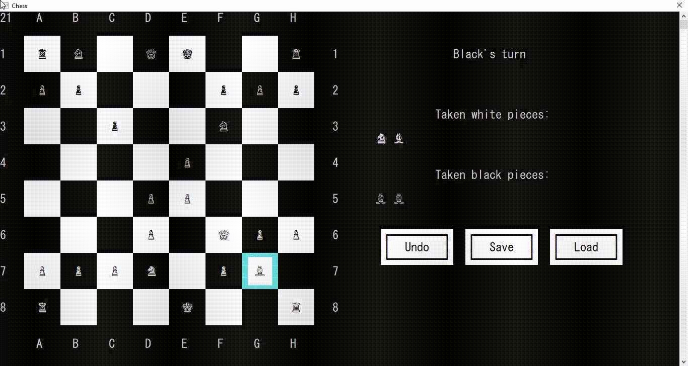
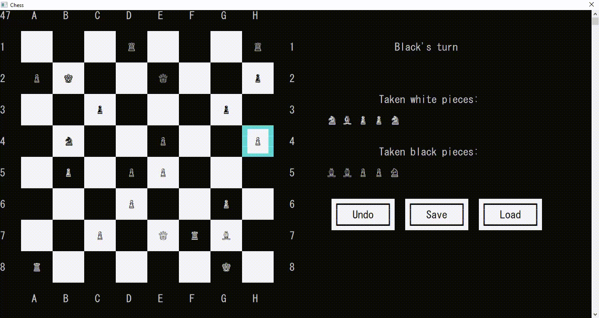
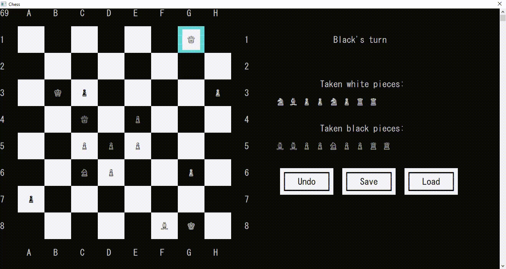
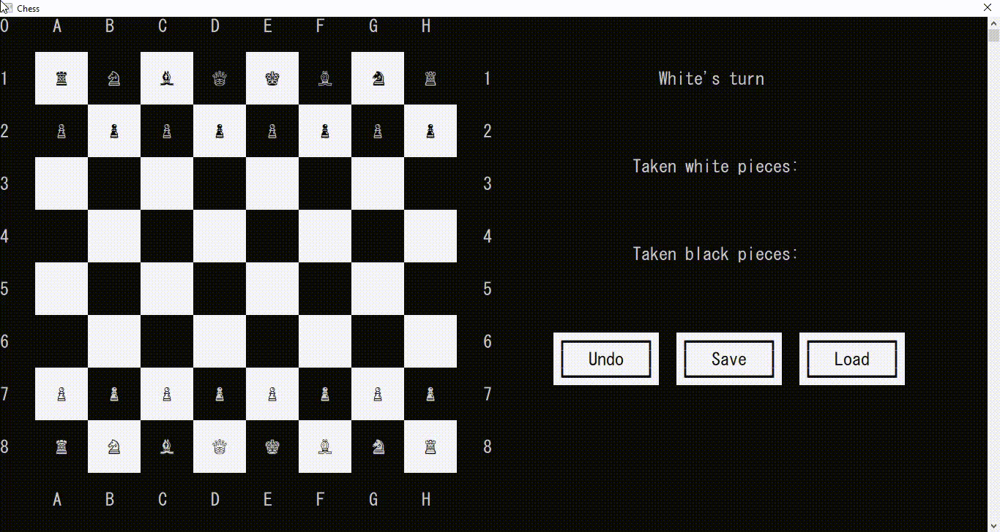
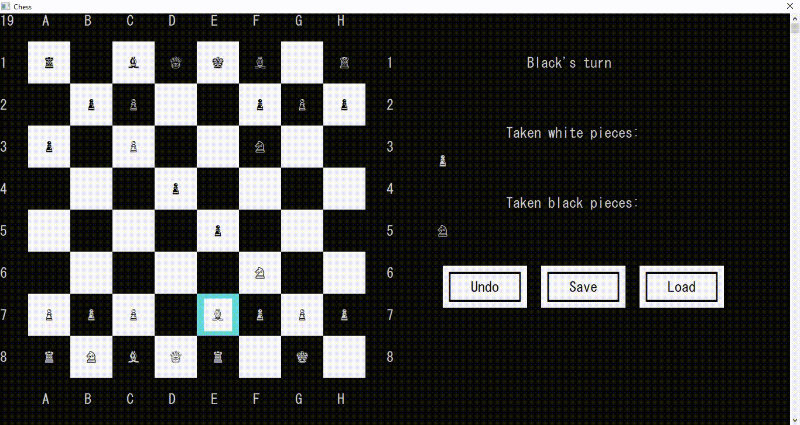

# Chess on Windows Command Prompt ♟️

This is a fun C project implementing a chess game playable on the Windows Command Prompt.

## Features

- Player vs Player Mode: Play against a friend locally on the same computer.
- Mouse Input: Control the game intuitively using your mouse.
- Undo: Made a mistake? No problem, take it back with the undo button.
- Save & Load Game: Save your ongoing games and resume them later.
- Interactive Buttons: Enjoy a user-friendly interface with clickable buttons with hover effects.

## Getting Started

To get started, follow these steps:

1. Clone the repository to your local machine.
2. Open Command Prompt and navigate to the project directory.
3. Compile the source code.
`gcc chess.c gui.c arraylist.c -o chess.exe`
4. Run the executable file to start the game.

## Demo

